# Headless TTY 

A headless terminal emulator that keeps `isatty()` returning `true` for spawned processes.

## What It Does

- Creates a real pseudo-terminal (PTY) via Windows ConPTY
- Spawned processes see `isatty(stdin) = true`, `isatty(stdout) = true`
- No visible console window needed - output is captured programmatically
- ANSI escape codes pass through correctly

## Why This Matters

Many CLI tools check `isatty()` to decide behavior:
- **Claude CLI**: Requires TTY for interactive mode, else crashes
- **Git**: Colors output only when TTY detected
- **Any NODE JS app using INK library for TUI**
- **Pythonw**: Interactive mode depends on TTY

Without a real PTY, hiding a console window breaks these tools because redirected STDIN/STDOUT report `isatty() = false`.

## Building

### Requirements
- Windows 10 version 1809+ (ConPTY support)
- clang
- CMake 3.16+

### Build Steps

```batch
# Using the build script
build.bat
```

## Usage

```batch
# Run cmd.exe (default)
headless-tty.exe

# Run a specific command
headless-tty.exe claude

# With custom terminal size
headless-tty.exe --width 80 --height 24 python

# Pass arguments to command
headless-tty.exe cmd /c dir
```

### Use with pythonw to launch claude code cli in headless mode but keep session alive

```python
headless_tty_exe = "path_to/headless-tty.exe"
ai_folder = r"path\to\folder"
cmd = [
    str(headless_tty_exe),
    "--",
    "claude",
    "--permission-mode", "bypassPermissions",
    "--append-system-prompt", system_prompt
]

self.headless_process = subprocess.Popen(
    cmd,
    startupinfo=startupinfo,
    creationflags=subprocess.CREATE_NEW_CONSOLE,
    cwd=str(ai_folder)
)
```

### Library Usage

You can also use the ConPTY wrapper as a library in your own C++ projects:

```cpp
#include <headless_tty/pty.hpp>

int main() {
    headless_tty::HeadlessTTY tty;

    headless_tty::Config config;
    config.size = { 120, 40 };
    config.command = L"claude.exe";

    // Set callback for output
    tty.set_output_callback([](const uint8_t* data, size_t len) {
        // Process output bytes
        fwrite(data, 1, len, stdout);
    });

    if (!tty.start(config)) {
        std::cerr << "Failed: " << tty.get_last_error() << std::endl;
        return 1;
    }

    // Wait for process to exit
    int exitCode = tty.wait();

    return exitCode;
}
```

### Options

| Option | Default | Description |
|--------|---------|-------------|
| `--width <cols>` | 120 | Terminal width in columns |
| `--height <rows>` | 40 | Terminal height in rows |
| `--help`, `-h` | | Show help message |


## API Reference

### `headless_tty::ConPTY`

Low-level ConPTY wrapper.

| Method | Description |
|--------|-------------|
| `initialize(size)` | Create the pseudo console |
| `spawn(cmd, args, cwd)` | Spawn a process attached to the PTY |
| `write(data, len)` | Write input to the PTY |
| `set_output_callback(cb)` | Set callback for PTY output |
| `start_reading()` | Start background read thread |
| `stop()` | Terminate process and cleanup |
| `is_running()` | Check if process is still running |
| `wait(timeout)` | Wait for process to exit |
| `resize(size)` | Resize the PTY |

### `headless_tty::HeadlessTTY`

High-level wrapper that manages the full lifecycle.

| Method | Description |
|--------|-------------|
| `start(config)` | Initialize and spawn process |
| `write(str)` | Send input to process |
| `set_output_callback(cb)` | Set callback for output |
| `stop()` | Stop the process |
| `is_running()` | Check if running |
| `wait(timeout)` | Wait for exit |

## How It Works

### Architecture Overview

```mermaid
%%{init: {'theme': 'dark', 'themeVariables': { 'primaryColor': '#1f2937', 'primaryTextColor': '#f3f4f6', 'primaryBorderColor': '#4b5563', 'lineColor': '#9ca3af', 'secondaryColor': '#374151', 'tertiaryColor': '#111827'}}}%%
flowchart TB
    subgraph parent["Parent Process"]
        app["Your Application"]
        stdin["STDIN"]
        stdout["STDOUT"]
    end

    subgraph htty["headless-tty.exe"]
        fwd["Input Forwarder"]
        cb["Output Callback"]

        subgraph pty["Windows ConPTY"]
            pc["Pseudo Console"]
            pin["Input Pipe"]
            pout["Output Pipe"]
        end
    end

    subgraph child["Child Process"]
        proc["claude.exe / cmd.exe / etc"]
        tty["isatty() = true"]
    end

    app -->|"spawns"| htty
    stdin -->|"raw bytes"| fwd
    fwd -->|"write"| pin
    pin --> pc
    pc --> proc
    proc --> tty
    pc --> pout
    pout -->|"read"| cb
    cb -->|"raw bytes"| stdout

    style stdin fill:#1a332a,stroke:#2d5a47
    style fwd fill:#1a332a,stroke:#2d5a47
    style pin fill:#1e3a2f,stroke:#2d5a47
    style stdout fill:#332a2a,stroke:#5a3d3d
    style cb fill:#332a2a,stroke:#5a3d3d
    style pout fill:#3a2a2a,stroke:#5a3d3d
    style pc fill:#1a2a3a,stroke:#3d4d5a
    style proc fill:#1a2a3a,stroke:#3d4d5a
    style tty fill:#2a3a1a,stroke:#4d5a3d
```



### Spawn Sequence

```mermaid
%%{init: {'theme': 'dark', 'themeVariables': { 'primaryColor': '#1f2937', 'primaryTextColor': '#f3f4f6', 'primaryBorderColor': '#4b5563', 'lineColor': '#9ca3af'}}}%%
sequenceDiagram
    participant App as Your App
    participant HTT as HeadlessTTY
    participant Win as Windows Kernel
    participant Child as Child Process

    App->>HTT: start(config)

    rect rgb(26, 42, 58)
        Note over HTT,Win: PTY Initialization
        HTT->>Win: CreatePipe() x2
        Win-->>HTT: Input & Output pipes
        HTT->>Win: CreatePseudoConsole(size, pipes)
        Win-->>HTT: HPCON handle
    end

    rect rgb(30, 51, 42)
        Note over HTT,Child: Process Spawn
        HTT->>Win: InitializeProcThreadAttributeList()
        HTT->>Win: UpdateProcThreadAttribute(PSEUDOCONSOLE)
        HTT->>Win: CreateProcessW(command)
        Win->>Child: Launch with PTY attached
        HTT->>Win: CreateJobObject()
        HTT->>Win: AssignProcessToJobObject()
        Note over HTT,Child: Child auto-terminates if parent dies
    end

    HTT->>HTT: start_reading()
    HTT-->>App: success

    rect rgb(51, 42, 42)
        loop While Running
            App->>HTT: write(input)
            HTT->>Child: via PTY pipe
            Child->>HTT: output via PTY pipe
            HTT->>App: output_callback(data)
        end
    end
```



### Data Flow

```mermaid
%%{init: {'theme': 'dark', 'themeVariables': { 'primaryColor': '#1f2937', 'primaryTextColor': '#f3f4f6', 'primaryBorderColor': '#4b5563', 'lineColor': '#9ca3af'}}}%%
flowchart LR
    subgraph input["Input Path"]
        direction LR
        si["STDIN"] --> fw["Forwarder Thread"]
        fw --> wp["Write Pipe"]
        wp --> pty1["PTY"]
        pty1 --> ci["Child STDIN"]
    end

    subgraph output["Output Path"]
        direction LR
        co["Child STDOUT"] --> pty2["PTY"]
        pty2 --> rp["Read Pipe"]
        rp --> rt["Read Thread"]
        rt --> so["STDOUT"]
    end

    style si fill:#1a332a,stroke:#2d5a47
    style fw fill:#1a332a,stroke:#2d5a47
    style wp fill:#1e3a2f,stroke:#2d5a47
    style pty1 fill:#1a2a3a,stroke:#3d4d5a
    style ci fill:#1a332a,stroke:#2d5a47
    style co fill:#332a2a,stroke:#5a3d3d
    style pty2 fill:#1a2a3a,stroke:#3d4d5a
    style rp fill:#3a2a2a,stroke:#5a3d3d
    style rt fill:#332a2a,stroke:#5a3d3d
    style so fill:#332a2a,stroke:#5a3d3d
```



### Process Lifecycle

```mermaid
%%{init: {'theme': 'dark', 'themeVariables': { 'primaryColor': '#1f2937', 'primaryTextColor': '#f3f4f6', 'primaryBorderColor': '#4b5563', 'lineColor': '#9ca3af', 'secondaryColor': '#374151'}}}%%
stateDiagram-v2
    [*] --> Uninitialized

    Uninitialized --> Initializing: start()

    state Initializing {
        [*] --> CreatePipes
        CreatePipes --> CreatePTY
        CreatePTY --> SetupAttributes
        SetupAttributes --> SpawnProcess
        SpawnProcess --> CreateJobObject
        CreateJobObject --> [*]
    }

    Initializing --> Running: success
    Initializing --> [*]: failure

    state Running {
        [*] --> Active
        Active --> Active: read/write
    }

    Running --> Stopping: stop() or process exits
    Running --> Stopping: parent killed

    state Stopping {
        [*] --> TerminateProcess
        TerminateProcess --> JoinThreads
        JoinThreads --> CloseHandles
        CloseHandles --> [*]
    }

    Stopping --> [*]

    classDef initState fill:#1a2a3a,stroke:#3d4d5a
    classDef runState fill:#1e3a2f,stroke:#2d5a47
    classDef stopState fill:#3a2a2a,stroke:#5a3d3d

    class Initializing initState
    class Running runState
    class Stopping stopState
```



### Note

The child process is killed when headless-terminal is terminated (even forcefully). This is by design to prevent orphaned processed during testing or failure scenarios.

For whatever reason if you do not want it, remove from pty.cpp

```cpp
m_hJob = CreateJobObjectW(NULL, NULL);
    if (m_hJob) {
        JOBOBJECT_EXTENDED_LIMIT_INFORMATION jeli = {};
        jeli.BasicLimitInformation.LimitFlags = JOB_OBJECT_LIMIT_KILL_ON_JOB_CLOSE;
        SetInformationJobObject(m_hJob, JobObjectExtendedLimitInformation, &jeli, sizeof(jeli));
        AssignProcessToJobObject(m_hJob, m_hProcess);
    }

    m_running.store(true);
    m_stop_requested.store(false);

    return true;
}

``` 

And clean up associated code. 

### License

Free for non-commercial use (even in commercial devices) and for commercial use below USD 50000 gross annual income threshold. 

For a complete license read (LICENSE)[LICENSE]

