# Headless TTY 

A headless terminal emulator built for native Windows OS, that keeps `isatty()` returning `true` for spawned processes while staying either completely invisible or hiding in system tray.

<p align="center">
  
</p>

## How to install

### Using Winget
```batch
winget install Revoconner.HeadlessTTY
```

### Manually
1. Go to the [releases page](https://github.com/revoconner/Headless-TTY/releases)
2. Download the latest version or one that suites your need


## What It Does

- Creates a real pseudo-terminal (PTY) via Windows ConPTY
- Spawned processes see `isatty(stdin) = true`, `isatty(stdout) = true`
- No visible console window needed - output is captured programmatically
- ANSI escape codes pass through correctly
- v2.5.0 - Now supports tray icon using --sys-tray argument. If you need a console for a long running process to see logs, or outputs just show from system tray and hide it back.
- v2.5.0 - Right-click tray icon to show/hide console on demand with full color output and VT sequences output support.

## Why This Matters

Many CLI tools check `isatty()` to decide behavior:
- **Claude CLI**: Requires TTY for interactive mode, else crashes
- **Git**: Colors output only when TTY detected
- **Any NODE JS app using INK library for TUI**
- **Pythonw**: Interactive mode depends on TTY

Without a real PTY, hiding a console window breaks these tools because redirected STDIN/STDOUT report `isatty() = false`.

## Does a non C++ developer has any use of it?
Kind of! One still has to be somewhat technically inclined.

When you want to start a CLI app headless at Windows starts using task scheduler, you usually create a bat file then a vbs script to spawn that bat file headless.

You can now simple use headless-tty to spawn cmd, or powershell etc, then call whatver you want from there. A few examples: 

- `headless-tty.exe -- python main.py` : run a python file main.py without console, I mean you could use pythonw, but you still have to call it from somewhere.
- `headless-tty.exe -- cmd /c "ipconfig -all >%temp%\ipconfig.txt && notepad %temp%\ipconfig.txt"` : Prints ipconfig to a file in temporary folder, then opens it in notepad, without ever showing console.
- `headless-tty.exe -- powershell ".\myscript.ps1"` : run a powershell script without console.
- `headless-tty.exe --sys-tray -- python -u main.py` : Run a long running python script but now with tray icon if you want to see outputs later, hide it away when not in use.

These are basic example of a non cpp dev using this.

## Building

### Requirements
- Windows 10 version 1809+ (ConPTY support)
- clang
- CMake 3.16+

### Build Steps

```batch
# Using the build script
build.bat
```

## Usage

```batch
# Run cmd.exe (default)
headless-tty.exe

# Run a specific command
headless-tty.exe claude

# Pass arguments to command
headless-tty.exe cmd /c dir
```

### System Tray Mode

Run processes in the background with a system tray icon. Right-click the tray icon to show/hide a console window on demand.

```batch
# Run with system tray icon
headless-tty.exe --sys-tray -- python -u main.py

# Run a long-running process in tray
headless-tty.exe --sys-tray -- node server.js
```

**How it works:**
- The process runs completely hidden
- A tray icon appears in your system tray (bottom-right)
- Right-click the icon to "Show Console" or "Hide Console"
- The console lets you see output and type commands
- Closing the console window (X button) exits everything
- If the child process exits, the tray icon disappears automatically

### Use with pythonw (example use case, not limited to) to launch claude code cli in headless mode but keep session alive

```python
import subprocess

headless_tty_exe = "headless-tty.exe"
cmd = [
    str(headless_tty_exe),
    "--",
    "claude"
]

headless_process = subprocess.Popen(
    cmd,
    creationflags=subprocess.CREATE_NEW_CONSOLE
)
```

### Library Usage

You can also use the ConPTY wrapper as a library in your own C++ projects:

```cpp
#include <headless_tty/pty.hpp>

int main() {
    headless_tty::HeadlessTTY tty;

    headless_tty::Config config;
    config.size = { 120, 40 };
    config.command = L"claude.exe";

    // Set callback for output
    tty.set_output_callback([](const uint8_t* data, size_t len) {
        // Process output bytes
        fwrite(data, 1, len, stdout);
    });

    if (!tty.start(config)) {
        std::cerr << "Failed: " << tty.get_last_error() << std::endl;
        return 1;
    }

    // Wait for process to exit
    int exitCode = tty.wait();

    return exitCode;
}
```

### Options

| Option | Description |
|--------|-------------|
| `--sys-tray` | Run with system tray icon (right-click for menu) |
| `--help`, `-h` | Show help message |


## API Reference

### `headless_tty::ConPTY`

Low-level ConPTY wrapper.

| Method | Description |
|--------|-------------|
| `initialize(size)` | Create the pseudo console |
| `spawn(cmd, args, cwd)` | Spawn a process attached to the PTY |
| `write(data, len)` | Write input to the PTY |
| `set_output_callback(cb)` | Set callback for PTY output |
| `start_reading()` | Start background read thread |
| `stop()` | Terminate process and cleanup |
| `is_running()` | Check if process is still running |
| `wait(timeout)` | Wait for process to exit |
| `resize(size)` | Resize the PTY |

### `headless_tty::HeadlessTTY`

High-level wrapper that manages the full lifecycle.

| Method | Description |
|--------|-------------|
| `start(config)` | Initialize and spawn process |
| `write(str)` | Send input to process |
| `set_output_callback(cb)` | Set callback for output |
| `stop()` | Stop the process |
| `is_running()` | Check if running |
| `wait(timeout)` | Wait for exit |

## How It Works

### Architecture Overview

```mermaid
%%{init: {'theme': 'dark', 'themeVariables': { 'primaryColor': '#1f2937', 'primaryTextColor': '#f3f4f6', 'primaryBorderColor': '#4b5563', 'lineColor': '#9ca3af', 'secondaryColor': '#374151', 'tertiaryColor': '#111827'}}}%%
flowchart TB
    subgraph parent["Parent Process"]
        app["Your Application"]
        stdin["STDIN"]
        stdout["STDOUT"]
    end

    subgraph htty["headless-tty.exe"]
        fwd["Input Forwarder"]
        cb["Output Callback"]
        mon["Monitor Thread"]

        subgraph pty["Windows ConPTY"]
            pc["Pseudo Console"]
            pin["Input Pipe"]
            pout["Output Pipe"]
        end
    end

    subgraph child["Child Process"]
        proc["powershell.exe / cmd.exe / pythonw.exe"]
        tty["isatty() = true"]
    end

    app -->|"spawns"| htty
    stdin -->|"raw bytes"| fwd
    fwd -->|"write"| pin
    pin --> pc
    pc --> proc
    proc --> tty
    pc --> pout
    pout -->|"read"| cb
    cb -->|"raw bytes"| stdout
    mon -->|"waits on"| proc
    proc -->|"exit"| mon
    mon -->|"closes"| pc

    style stdin fill:#1a332a,stroke:#2d5a47
    style mon fill:#2a2a3a,stroke:#4d4d6a
    style fwd fill:#1a332a,stroke:#2d5a47
    style pin fill:#1e3a2f,stroke:#2d5a47
    style stdout fill:#332a2a,stroke:#5a3d3d
    style cb fill:#332a2a,stroke:#5a3d3d
    style pout fill:#3a2a2a,stroke:#5a3d3d
    style pc fill:#1a2a3a,stroke:#3d4d5a
    style proc fill:#1a2a3a,stroke:#3d4d5a
    style tty fill:#2a3a1a,stroke:#4d5a3d
```



### Spawn Sequence

```mermaid
%%{init: {'theme': 'dark', 'themeVariables': { 'primaryColor': '#1f2937', 'primaryTextColor': '#f3f4f6', 'primaryBorderColor': '#4b5563', 'lineColor': '#9ca3af'}}}%%
sequenceDiagram
    participant App as Your App
    participant HTT as HeadlessTTY
    participant Win as Windows Kernel
    participant Child as Child Process

    App->>HTT: start(config)

    rect rgb(26, 42, 58)
        Note over HTT,Win: PTY Initialization
        HTT->>Win: CreatePipe() x2
        Win-->>HTT: Input & Output pipes
        HTT->>Win: CreatePseudoConsole(size, pipes)
        Win-->>HTT: HPCON handle
    end

    rect rgb(30, 51, 42)
        Note over HTT,Child: Process Spawn
        HTT->>Win: InitializeProcThreadAttributeList()
        HTT->>Win: UpdateProcThreadAttribute(PSEUDOCONSOLE)
        HTT->>Win: CreateProcessW(command)
        Win->>Child: Launch with PTY attached
        HTT->>Win: CreateJobObject()
        HTT->>Win: AssignProcessToJobObject()
        Note over HTT,Child: Child auto-terminates if parent dies
    end

    HTT->>HTT: start_reading()
    HTT->>HTT: start monitor_thread()
    Note over HTT: Monitor waits on child process handle
    HTT-->>App: success

    rect rgb(51, 42, 42)
        loop While Running
            App->>HTT: write(input)
            HTT->>Child: via PTY pipe
            Child->>HTT: output via PTY pipe
            HTT->>App: output_callback(data)
        end
    end

    rect rgb(42, 42, 51)
        Note over HTT,Child: Child Exit Detection
        Child->>HTT: process exits
        HTT->>HTT: monitor_thread detects exit
        HTT->>Win: ClosePseudoConsole()
        Note over HTT: Pipes break, read_loop exits
        HTT-->>App: is_running() = false
    end
```



### Data Flow

```mermaid
%%{init: {'theme': 'dark', 'themeVariables': { 'primaryColor': '#1f2937', 'primaryTextColor': '#f3f4f6', 'primaryBorderColor': '#4b5563', 'lineColor': '#9ca3af'}}}%%
flowchart LR
    subgraph input["Input Path"]
        direction LR
        si["STDIN"] --> fw["Forwarder Thread"]
        fw --> wp["Write Pipe"]
        wp --> pty1["PTY"]
        pty1 --> ci["Child STDIN"]
    end

    subgraph output["Output Path"]
        direction LR
        co["Child STDOUT"] --> pty2["PTY"]
        pty2 --> rp["Read Pipe"]
        rp --> rt["Read Thread"]
        rt --> so["STDOUT"]
    end

    subgraph termination["Termination Path"]
        direction LR
        ce["Child Exit"] --> mt["Monitor Thread"]
        mt --> cp["ClosePseudoConsole"]
        cp --> pb["Pipes Break"]
        pb --> pe["Parent Exit"]
    end

    style si fill:#1a332a,stroke:#2d5a47
    style fw fill:#1a332a,stroke:#2d5a47
    style wp fill:#1e3a2f,stroke:#2d5a47
    style pty1 fill:#1a2a3a,stroke:#3d4d5a
    style ci fill:#1a332a,stroke:#2d5a47
    style co fill:#332a2a,stroke:#5a3d3d
    style pty2 fill:#1a2a3a,stroke:#3d4d5a
    style rp fill:#3a2a2a,stroke:#5a3d3d
    style rt fill:#332a2a,stroke:#5a3d3d
    style so fill:#332a2a,stroke:#5a3d3d
    style ce fill:#2a2a3a,stroke:#4d4d6a
    style mt fill:#2a2a3a,stroke:#4d4d6a
    style cp fill:#2a2a3a,stroke:#4d4d6a
    style pb fill:#2a2a3a,stroke:#4d4d6a
    style pe fill:#2a2a3a,stroke:#4d4d6a
```



### Process Lifecycle

```mermaid
%%{init: {'theme': 'dark', 'themeVariables': { 'primaryColor': '#1f2937', 'primaryTextColor': '#f3f4f6', 'primaryBorderColor': '#4b5563', 'lineColor': '#9ca3af', 'secondaryColor': '#374151'}}}%%
stateDiagram-v2
    [*] --> Uninitialized

    Uninitialized --> Initializing: start()

    state Initializing {
        [*] --> CreatePipes
        CreatePipes --> CreatePTY
        CreatePTY --> SetupAttributes
        SetupAttributes --> SpawnProcess
        SpawnProcess --> CreateJobObject
        CreateJobObject --> [*]
    }

    Initializing --> Running: success
    Initializing --> [*]: failure

    state Running {
        [*] --> Active
        Active --> Active: read/write
        Active --> Monitoring: monitor_thread watches child
        Monitoring --> Active
    }

    Running --> Stopping: stop() called
    Running --> Stopping: parent killed (job object kills child)
    Running --> Stopping: child exits (monitor closes PTY)

    state Stopping {
        [*] --> TerminateProcess
        TerminateProcess --> JoinThreads
        JoinThreads --> CloseHandles
        CloseHandles --> [*]
    }

    Stopping --> [*]

    classDef initState fill:#1a2a3a,stroke:#3d4d5a
    classDef runState fill:#1e3a2f,stroke:#2d5a47
    classDef stopState fill:#3a2a2a,stroke:#5a3d3d

    class Initializing initState
    class Running runState
    class Stopping stopState
```



## Note

**Bidirectional Process Termination**

The process lifecycle is managed bidirectionally:

1. **Parent killed -> Child dies**: A Job Object with `JOB_OBJECT_LIMIT_KILL_ON_JOB_CLOSE` ensures the child process (and all its descendants) are terminated when headless-tty exits, even if killed forcefully.

2. **Child exits -> Parent exits**: A monitor thread watches the child process handle. When the child exits (e.g., user closes notepad), the monitor calls `ClosePseudoConsole()` which terminates conhost and breaks the pipes, causing headless-tty to exit cleanly.
    - Limitation: Although it works great for win32 apps as well as UWP apps (we are only talking about GUI here, all CLI apps works perfectly), there's a caveat in the UWP app, that it spawns the multiple PID. If you forcefully kill any child PID in the middle of the chain, you may leave orphan processes. 

This prevents orphaned processes in both directions.

**To disable parent->child termination**, remove from pty.cpp:

```cpp
m_hJob = CreateJobObjectW(NULL, NULL);
if (m_hJob) {
    JOBOBJECT_EXTENDED_LIMIT_INFORMATION jeli = {};
    jeli.BasicLimitInformation.LimitFlags = JOB_OBJECT_LIMIT_KILL_ON_JOB_CLOSE;
    SetInformationJobObject(m_hJob, JobObjectExtendedLimitInformation, &jeli, sizeof(jeli));
    AssignProcessToJobObject(m_hJob, m_hProcess);
}
```

**To disable child->parent termination**, remove `monitor_loop()` and related code. 

## Helper file - Messenger.cpp

This tiny executable file must be spawned with UAC elevation. 
Mostly needed if you want an INK - https://github.com/vadimdemedes/ink 
app such as gemini cli or claude code...
you will need their pid and this to send message.

Such apps, while will get the message from emulator,
but won't process return key to send.


**Implementation pseudocode:**

```python
pseudocode: messenger_wrapper.py

import os, time, hmac, hashlib, subprocess, secrets
from pathlib import Path

class MessengerAuth:
    def __init__(self, target_pid, target_name):
        self.secret = secrets.token_bytes(32)  # Raw bytes
        self.target_pid = target_pid
        self.target_name = target_name
        self.pipe_name = f"\\\\.\\pipe\\InjectorAuth_{os.getpid()}"
        
    def start_pipe_server(self):
        # Create named pipe, serve on connect:
        # Send: f"{self.secret.hex()}\n{self.target_pid}\n{self.target_name}"
        # Verify caller binary hash before responding (optional)
        pass
    
    def sign(self, command):
        ts = str(int(time.time()))
        msg = f"{self.target_pid}|{command}|{ts}"
        sig = hmac.new(self.secret, msg.encode(), hashlib.sha256).hexdigest()
        return ts, sig
    
    def send(self, command):
        ts, sig = self.sign(command)
        result = subprocess.run([
            "messenger.exe",
            str(self.target_pid),
            command,
            ts,
            sig
        ])
        return result.returncode

# Usage
auth = MessengerAuth(pid=12345, target_name="claude.exe")
auth.start_pipe_server()  # In background thread

auth.send("hello world")  # Text + Enter
auth.send("--tab")        # Special key
auth.send("--escape")

```

---


## Changelog

#### 1.0.0
**Development** - not released

#### 1.5.0
**Initial release**
- Uses c++17 standard
- Keeps isatty()=True for console TUI apps without showing console.
- Shows console for GUI apps. For example starting `headless-tty.exe -- notepad` will show a console (empty).

#### 2.0.0
**Second release**
- Uses c++23
- Comes with helper binary messenger.exe with authentication pipeline built in (NO server file, but pseudocode present in Readme.md)
- Added truly headless mode
    - Keeps console hidden for GUI apps for example `headless-tty.exe -- notepad` shows no console
    - Keeps console hidden for console apps while keeping isatty()=True, for example `headless-tty.exe -- claude` shows no console but keeps claude code CLI INK app hidden in interactive mode and isatty()=True (or else it would have crashed)
    - Replaced deprecated call
- Bidirectional process termination
    - Killing headless-tty kills the child process (Job Object)
    - Closing/killing the child process causes headless-tty to exit cleanly (Monitor Thread)
- Comes with an example showcase file written in python `usage_example.py` to help showcase the Software's potential.

#### 2.5.0
**System Tray Mode**
- Added `--sys-tray` flag for running processes with a system tray icon
- Right-click tray icon to show/hide console on demand
- Console supports full color output and VT sequences
- Closing console window exits the application
- Child process exit automatically removes tray icon
- Help message now displays when running with `-h` or `--help` from command line
    

---

### License in short

<details><summary>Meaning of the word "The Software" and "Derivative Work" </summary>
<br>
"The Software" refers to the source code, object code, documentation, and any other materials contained in this
repository, including any modified version of any of it.
<br>
"Derivative Work" or "derivatives" means any work that is based on or derived from the Software, such as modified application that has been forked from this repo.
</details>
<br>
<details><summary>Is the Software free for non commercial use? </summary>
<br>
Yes!
</details>
<br>
<details><summary>Can I use it on a computer I normally use for work, and other commercial activities?</summary>
<br>
Yes! As long as you are not using "the Software" or it's "Derivative Work" for commercial use or sublicensing, it's free for you<br>
and the gross annual income threshold does not apply to you. 
</details>
<br>
<details><summary>Does that mean if my income is more than $50,000 but I use the Software non-commercially, do I have to get another license?</summary>
<br>
No, as long as you do not use the Software or Derivative work to generate that income, it does not count towards commercial usage and the threshold limit does not apply.
</details>
<br>

If you want a waiver, please get in touch - [License waiver](https://github.com/revoconner/Headless-TTY/discussions/5)


Read LICENSE for details, the LICENSE will take precedence over the above given summary in a court of Law, if a conflict presents itself.

---

### AI Use

**To keep things transparent for my users, any AI use will be disclosed here:**
- (GENERATION/REGENERATION) All mermaid flow charts has been implemented by using AI, then checked by the developer.
- (GENERATION/REGENERATION) Some **comments**, and most **variable names** have been changed (regenerated) using AI to be more legible for the end user. Variable names have been tested afterwards to be functional.
- (GENERATION/REGENERATION) This README.md, and SECURITY.md has been in most part been generated by AI, then checked to be legibile and accurate.
- (INFORMATION/RESEARCH) Some research for the use of conpty and newer api, was done using web search tool with AI.
- (INFORMATION/RESEARCH) Syntax for linting using clang-tidy and inclusion of all header files during the linting process was formed by AI after parsing the official documentation.
- (INFORMATION/RESEARCH) Security change notice of some keywords in C++23 standard that clang-tidy showed, were in part researched by AI.


